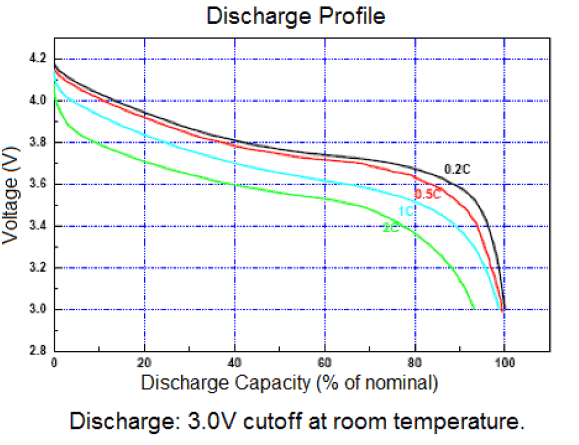
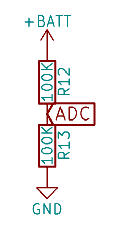

# Battery Capacity Experiment

## Goal

We want to know how much power the battery has left, given the current battery voltage. Since voltage drops in a non-linear way, this is hard to calculate. This is an example curve for 3.3V batteries of this type:



However, we couldn't find concrete data for our specific battery. The goal of this experiment is to log a complete battery discharge cycle, and to use those values for:

1) A lookup table. This lookup table will allow apps to quickly find out the battery level (in percentage) based on the current voltage.
2) Investigate the difference between simply reading the ADC pin, and using the ESP API `esp_adc_cal_raw_to_voltage()`.
3) We want to know how close the results are to this commonly used approximation function:
```
percentage = 2808.3808 * pow(voltage, 4) - 43560.9157 * pow(voltage, 3) + 252848.5888 * pow(voltage, 2) - 650767.4615 * voltage + 626532.5703
```

## Experiment Setup

The included firmware connects the esp32 to WiFi, and publishes the battery voltage to a web page every 10 seconds. The included `index.php` captures the GET request and writes the voltage to a log on the server's side. A benefit of using WiFi is that the battery drains quite fast, as opposed to storing the log in flash memory. This helps to get a full discharge cycle in less time. 

## How Voltage is Read: Original Code

In the original Watchy code the voltage is obtained by:
```
analogRead(ADC_PIN) / 4096.0 * 7.23;
```

These magic constants are used, because the ADC line expects voltages up to 3.3V, but our battery can provide more (up to 4.2V!). As this wouldn't allow us to read voltages above 3.3V, the signal is scaled down first. Most microcontroller board do this using a [voltage divider](https://en.wikipedia.org/wiki/Voltage_divider). As shown in the [Watchy schematics](https://watchy.sqfmi.com/docs/hardware), it looks like this for the Watchy:



So to explain the magic constants above:

* `analogRead()` returns a value between 0 and 4096, which maps to 0 and 3.3V respectively
* The value read by `analogRead()` is half the actual voltage of the battery (it was scaled down by the divider)
* One could rewrite the calculation as `((analogRead() / 4096) * 3.3) * 2` (normalise, map it to a range of 0-3300, and double it to compansate for voltage divider)
* Apparently it's also required to compensate for the 1.1V ADC reference voltage, so the multiplication at the end becomes `3.3 * 2 * 1.1`, which gives us 7.26. This is more or less what is used in the original Watchy code.
* However, the ADC reference voltage is not exactly 1.1V, and differs between models, which explains the difference with the formula above.

run `python3 ~/.platformio/packages/tool-esptoolpy/espefuse.py --port /dev/cu.SLAB_USBtoUART adc_info` if you want to know the value for your esp32. For me it was 1142mV.

## How Voltage is Read: ESP API

```
#include "esp_adc_cal.h"

// variables
static const adc1_channel_t BATTERY_READ_PIN = ADC1_GPIO33_CHANNEL;
esp_adc_cal_characteristics_t *adc_chars = new esp_adc_cal_characteristics_t;

// setup
adc1_config_width(ADC_WIDTH_BIT_12);
adc1_config_channel_atten(BATTERY_READ_PIN, ADC_ATTEN_DB_11);
esp_adc_cal_characterize(ADC_UNIT_1, ADC_ATTEN_DB_11, ADC_WIDTH_BIT_12, 1100, adc_chars);
    
// read voltage
float getBatteryVoltage(){
    float analog = adc1_get_raw(BATTERY_READ_PIN);
    return esp_adc_cal_raw_to_voltage(analog, adc_chars) * 2.0 / 1000.0;
}

```

## Run the Experiment

Make sure the battery is fully charged before you start. Then compile and flash the firmware (change WiFi credentials in the code). Unplug the USB cable right after flashing. Let it run until there are no more log entries coming in. 

## Process Data

The included `sample.py` will process the log file, and print a lookup table that maps voltage with battery capacity percentages. Change the "FILE_NAME" string to point to your downloaded log file. Change the "SAMPLES" value at the top of the script to determine how many rows you want in the lookup table. For example, `SAMPLES=5` will give a table with 20% increments (0%, 20%, 40%, 60%, 80% and 100%). Use `SAMPLES=100` for a table with all possible percentages. 

The output will also contain the approximation calculated with the formula mentioned above, as comparison. 

## Results


## Todo

Use esp_adc_cal_raw_to_voltage() to get voltage, as this should be more accurate.

python3 ~/.platformio/packages/tool-esptoolpy/espefuse.py --port /dev/cu.SLAB_USBtoUART adc_info
1142mV
