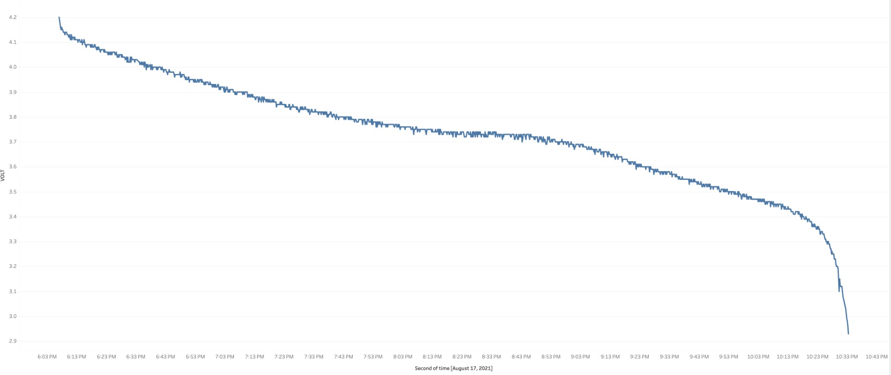

# Battery Capacity Experiment

## Goal

We want to know how much power the battery has left, given the current battery voltage. Since voltage drops in a non-linear way, this is hard to calculate. This is an example curve for 3.3V batteries of this type:


However, we couldn't find concrete data for our specific battery. The goal of this experiment is to log a complete battery discharge cycle, and to use those values for:

1) A lookup table. This lookup table will allow apps to quickly find out the battery level (in percentage) based on the current voltage.
2) Investigate the difference between simply reading the ADC pin, and using the ESP API `esp_adc_cal_raw_to_voltage()`.
3) We want to know how close the results are to this commonly used approximation function:
```
percentage = 2808.3808 * pow(voltage, 4) - 43560.9157 * pow(voltage, 3) + 252848.5888 * pow(voltage, 2) - 650767.4615 * voltage + 626532.5703
```

## Experiment Setup

The included firmware connects the esp32 to WiFi, and publishes the battery voltage to a web page every 10 seconds. The included `index.php` captures the GET request and writes the voltage to a log on the server's side. A benefit of using WiFi is that the battery drains quite fast, as opposed to storing the log in flash memory. This helps to get a full discharge cycle in less time. 

## How Voltage is Read

### Option 1: Original Watchy code with magic multiplier

In the original Watchy code the voltage is obtained by:
```
analogRead(ADC_PIN) / 4096.0 * 7.23;
```

These magic constants are used, because the ADC line expects voltages up to 3.3V, but our battery can provide more (up to 4.2V!). As this wouldn't allow us to read voltages above 3.3V, the signal is scaled down first. Most microcontroller board do this using a [voltage divider](https://en.wikipedia.org/wiki/Voltage_divider). As shown in the [Watchy schematics](https://watchy.sqfmi.com/docs/hardware), it looks like this for the Watchy:


So to explain the magic constants above:

* `analogRead()` returns a value between 0 and 4096, which maps to a value between 0 and 3.3V
* The value read by `analogRead()` is only half the actual voltage of the battery (it was scaled down by the divider)
* One could rewrite the calculation as `((analogRead() / 4096) * 3.3) * 2` (normalise analog value, map it to a range of 0-3300, and double it to compensate for voltage divider)
* It's also required to compensate for the 1.1V ADC reference voltage, so the multiplication at the end becomes `3.3 * 2 * 1.1`, which gives us 7.26. This is more or less what is used in the original Watchy code.
* However, the ADC reference voltage is not exactly 1.1V, and differs between models, which explains the difference with the formula above.

run `python3 ~/.platformio/packages/tool-esptoolpy/espefuse.py --port /dev/cu.SLAB_USBtoUART adc_info` if you want to know the value for your esp32. For me it was 1142mV, but this seems to be wildly different between different Watchy.

### Option 2: ESP API

```C
#include "esp_adc_cal.h"

// variables
esp_adc_cal_characteristics_t adc_chars = esp_adc_cal_characteristics_t();

// setup
adc1_config_width(ADC_WIDTH_BIT_12);
adc1_config_channel_atten(ADC1_GPIO33_CHANNEL, ADC_ATTEN_DB_11);
esp_adc_cal_characterize(ADC_UNIT_1, ADC_ATTEN_DB_11, ADC_WIDTH_BIT_12, 1100, &adc_chars);
    
// read voltage
float getBatteryVoltage() {
    int analog = adc1_get_raw(ADC1_GPIO33_CHANNEL);
    return esp_adc_cal_raw_to_voltage(analog, &adc_chars) * 2.0 / 1000.0;
}
```

Note that the return value of esp_adc_cal_raw_to_voltage() still has to be doubled to compensate for the voltage divider. The ESP32 itself is not even aware of the voltage division, as this is done by external hardware (resistors).

To see how accurate this is, we measured the battery voltage with a multimeter (Brymen bm867s) at various times, and compared to the return value of the API.

| Multimeter | ESP API | Difference |
| ---------- | ------- | ---------- |
| 4.208      | 4.18    | 0.66%      |
| 4.039      | 4.01    | 0.72%      |
| 3.913      | 3.90    | 0.33%      |
| 3.820      | 3.80    | 0.52%      |
| 3.771      | 3.75    | 0.56%      |
| 3.767      | 3.74    | 0.71%      |
| 3.634      | 3.60    | 0.94%      |
| 3.514      | 3.48    | 0.97%      |

Note that the battery was taken out of the Watchy to measure it. It was then put back, where the Watchy measured the voltage (before turning on WiFi etc.). Because of this setup, the Watchy consumes a tiny bit of battery while booting, which means that the differences in the table above are even smaller in reality. 

Conclusion: the voltage reported by the ESP API is extremely close to the real voltage, and there is no need to investigate other methods.

## Run the Experiment

Make sure the battery is fully charged before you start. Then compile and flash the firmware (change WiFi credentials in the code). Unplug the USB cable right after flashing. Let it run until there are no more log entries coming in. 

## Process Data

The included `sample.py` will process the log file, and print a lookup table that maps voltage with battery capacity percentages. Change the "FILE_NAME" string to point to your downloaded log file. Change the "SAMPLES" value at the top of the script to determine how many rows you want in the lookup table. For example, `SAMPLES=5` will give a table with 20% increments (0%, 20%, 40%, 60%, 80% and 100%). Use `SAMPLES=100` for a table with all possible percentages. 

The output will also contain the approximation calculated with the formula mentioned above, as comparison. 

## Results

See the included `log_original.txt` for the raw data produced by the PHP logging script. As discussed before, the data from the ESP API is by far the most accurate, so we ignore the other methods for now. Once plotted, the data from the ESP API follows the expected curve:



However, it should be noted that the Watchy rebooted when the voltage dropped under 3.20V, but then continued to upload a few more measurements. We concluded that the Watchy becomes unreliable (brown-out) at 3.20V, so we took this as a cut-off point and removed any later measurements from the data set (see `log_bounded.txt`).

After running this through the included `sample.py`, with `SAMPLES=100`, we get a long table. Run the script yourself for the full table, but here is the C-style array (101 elements, with index 0 represting voltage at 0%, and index 100 representing voltage at 100% capacity):

```
[3.2,3.28,3.34,3.37,3.39,3.42,3.42,3.44,3.44,3.46,3.47,3.47,3.48,3.5,3.5,3.51,3.52,3.53,3.53,3.54,3.55,3.56,3.57,3.57,3.59,3.6,3.61,3.62,3.63,3.65,3.65,3.66,3.67,3.67,3.68,3.7,3.69,3.7,3.71,3.71,3.72,3.72,3.71,3.73,3.72,3.74,3.72,3.74,3.73,3.73,3.72,3.74,3.75,3.74,3.75,3.74,3.76,3.76,3.76,3.77,3.77,3.79,3.79,3.79,3.79,3.8,3.8,3.82,3.82,3.81,3.83,3.84,3.84,3.85,3.86,3.86,3.87,3.88,3.9,3.91,3.9,3.92,3.93,3.95,3.95,3.95,3.97,3.98,3.98,4.0,4.02,4.03,4.04,4.05,4.06,4.08,4.09,4.1,4.11,4.13,4.2]
```

Warning: due to fluctuations in the voltage, the values are not always in increasing order!

## Conclusions

* The ESP API is by far the most accurate way to measure battery voltage (the commonly used approximation function mention in the beginning doesn't even come close).
* Voltage fluctuates quite heavily in the Watchy.
* When voltage dips under 3.2V, the Watchy is not completely dead but it becomes unreliable (brown-outs).
* Voltage hovers around 3.7V for a very long time (the flat plateau in the middle of the chart), making it difficult to guess how much power is left in the battery during this period. 

